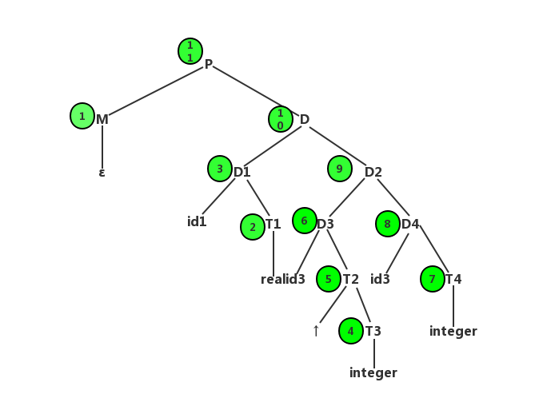

# 编译器

## 词法分析器

测试句子:
- begin x:=9; if x>9 then x:=2*x+1/3; end #
- begin x:=9a; if x><9 then x<>2*x+1/3;, end #

## 语法分析器

测试句子:
- i+i*i$
- i++i**i$
- (i+i*i)+i$
- i+i*i+$

## 语义分析器

翻译模式:

产生式规则 | 语义规则
--- | ---
P—>MD|{ addwidth(top(tblptr), top(offset)); pop(tblptr); pop(offset) }
M—>ε | { t = mktable(nil); push(t,tblptr); push(0,offset)}
D—>D1; D2 | 
D—>proc id; N D1; S | { t = top(tblptr); addwidth(t,top(offset)); pop(tblptr); pop(offset); enterproc(top(tblptr), id.name, t) }
D—>id:T | { enter(top(tblptr),id.name,T.type,top(offset)); top(offset) = top(offset) + T.width }
N—>ε | { t = mktable(top(tblptr)); push(t,tblptr); push(0,offset) }
T—>integer | { T.type = integer; T.width = 4 }
T—>real | { T.type = real; T.width = 8 }
T—>↑T1 | {T.type = pointer(T1.type); T.width = 4}

tips:
- mktable(previous):创建一张新的符号表，并返回指向新表的指针。参数previous指向先前创建的符号，放在新符号表的表头。
- enter(table, name, type, offset)：在table指向的符号表中为名字name建立新表项，同时将类型type及相对地址offset放入该表项的属性域中。
- addwidth(table, width)：将table指向的符号表中所有表项的宽度之和记录在与符号表关联的表头中。
- enterproc(table, name, newtable)：在table指向的符号表中为过程name建立一个新表项，参数newtable指向过程name的符号表。
- 栈tblptr：保存指向外围过程符号表的指针。
- 栈offset：其栈顶元素是下一个当前过程中局部对象可用的相对地址。

测试句子:
- d1 : real ; id2 :↑integer; id3:integer

语法分析树

